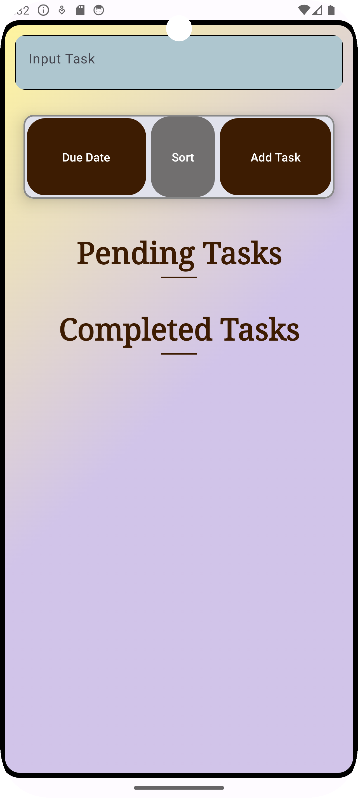
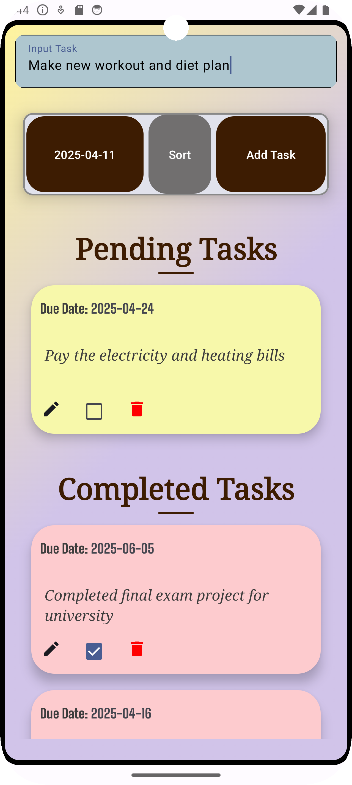

# 📚 TO-DO App 

### A simple and intuitive To-Do application built with **Kotlin and Jetpack Compose**.
### Features task management with local storage using **Room Database**.
### Includes UI and Unit Testing with **JUnit, Mockito and Jetpack Compose UI Testing**.

---

## ✨ Key Features
- ✅ **Add, edit, and delete tasks**
- ✅ **Mark tasks as completed**
- ✅ **Sort tasks in ascending/descending order**
- ✅ **Save tasks persistently using Room Database**
- ✅ **Intuitive and modern UI with Jetpack Compose**
- ✅ **Uses LazyColumn for smooth scrolling task lists**

---

### 🛠️ Tech Stack & Skills Used

- **Kotlin** – Primary programming language
- **Jetpack Compose** – Modern UI toolkit for declarative UI
- **Room Database** – Local storage for tasks
- **JUnit** - Unit tests for ViewModel logic
- **Mockito** - For mocking dependencies in unit tests
- **Compose UI Testing** - UI automation for Jetpack Compose
- **Architecture** – MVVM (Model-View-ViewModel)
- **State Management** – Using ViewModel and StateFlow
- **Material Design 3** – UI components for a sleek look
- **Coroutines** – For efficient background operations
- **Logging & Debugging** – Android Logcat (`Log.d`)

---

## 📸 Screenshots





---

## 🛠️ Future Enhancements
- 📌 **Implement Notifications for task reminders**
- ☁️ **Add Firebase for cloud sync**
- 🎨 **Improve UI animations**
- 🛠️ **Fix failing tests to improve app stability and responsiveness** 


___

## 🚀 How to Run the App
Clone this repository:
```sh
git clone https://github.com/TravisKula/ToDoApp.git
```
1. **Open in Android Studio.**
2. **Connect an emulator or physical device.**
3. **Click Run ▶️ to start the app.**
4️. **Start managing your To-Do tasks efficiently! ✅**

---

"🚀 **Want more cool projects?** Check out my [GitHub](https://github.com/TravisKula)!"